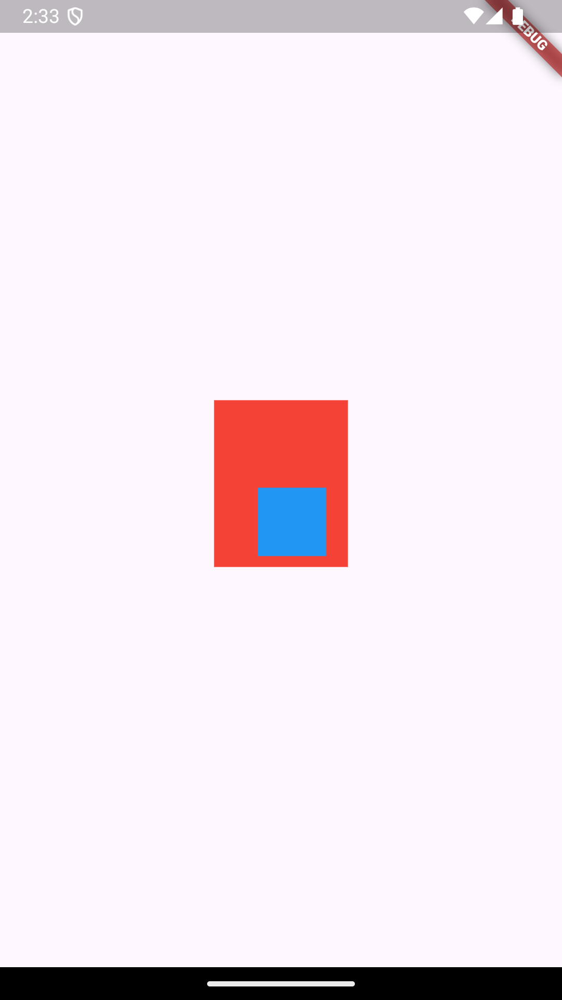
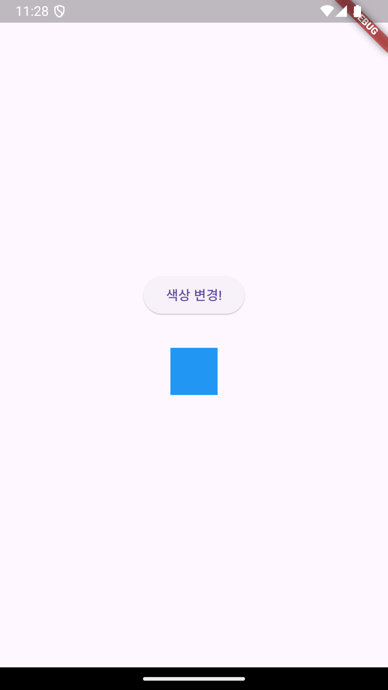

# 00. basic concepts of Flutter

### row_and_column

- how to use `row` and `column` 
- result
  

### padding_theory

- how to use `padding`

- result
  

### statefulwidget

- what is the diffrence between `statelesswidget` and `statefulwidget`.
- result
  

